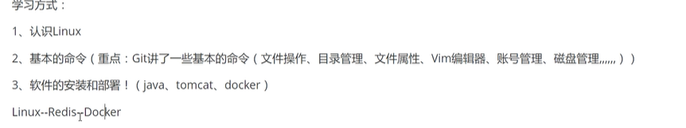
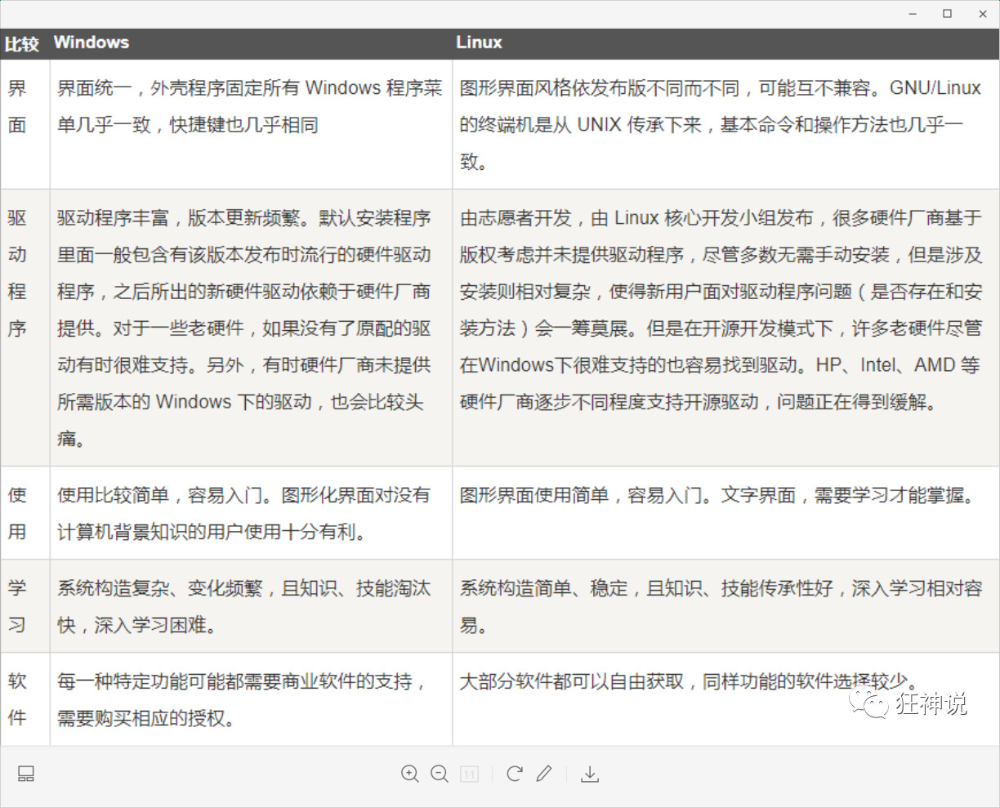
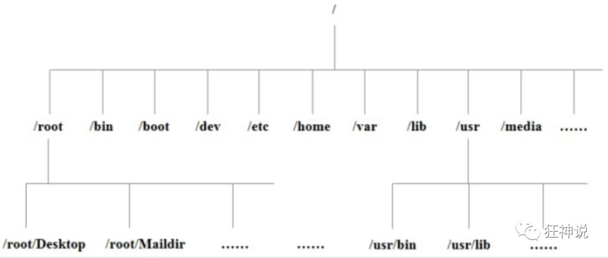
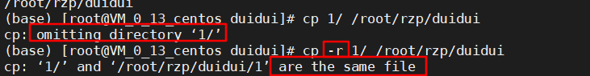
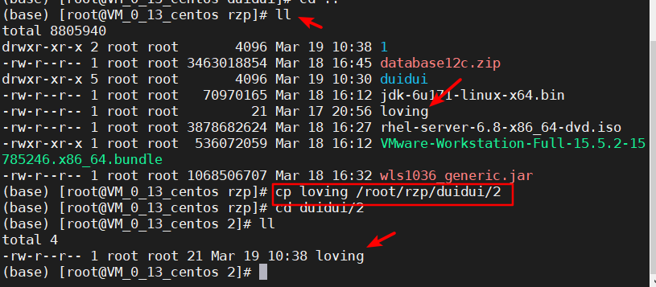
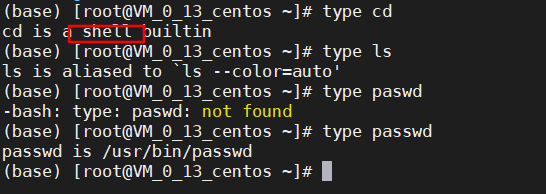

### 学习方式



### 应用领域

* LAMP（Linux + Apache + MySQL + PHP）
* LNMP（Linux + Nginx+ MySQL + PHP）组合。

### 与Windows主要区别

1. 严格区分大小写
2. Linux一切都是文件。
   * 比如配置，一定要改文件？
3. 不区分后缀



### 镜像

1.镜像站

2.狂神

https://pan.baidu.com/share/init?surl=e0YEzN3BW0DDXFtMscvvVA

716m

### 关机

在linux领域内大多用在服务器上，很少遇到关机的操作。毕竟服务器上跑一个服务是永无止境的，除非特殊情况下，不得已才会关机。

关机指令为：shutdown ；

```
sync # 将数据由内存同步到硬盘中。

shutdown # 关机指令，你可以man shutdown 来看一下帮助文档。例如你可以运行如下命令关机：

shutdown –h 10 # 这个命令告诉大家，计算机将在10分钟后关机

shutdown –h now # 立马关机

shutdown –h 20:25 # 系统会在今天20:25关机

shutdown –h +10 # 十分钟后关机

shutdown –r now # 系统立马重启

shutdown –r +10 # 系统十分钟后重启

reboot # 就是重启，等同于 shutdown –r now

halt # 关闭系统，等同于shutdown –h now 和 poweroff
```

最后总结一下，不管是重启系统还是关闭系统，首先要运行 **sync** 命令，把内存中的数据写到磁盘中。

### Linux目录结构

* Linux就是一个大文件夹，"/"就是根目录。
* * 树状目录结构：（Linux的一切资源都挂载在这个 / 根节点下）

    

    **以下是对这些目录的解释：**

    - **/bin**：bin是Binary的缩写, 这个目录存放着最经常使用的命令。
    - **/boot：** 这里存放的是启动Linux时使用的一些核心文件，包括一些连接文件以及镜像文件。
    - **/dev ：** dev是Device(设备)的缩写, 存放的是Linux的外部设备，在Linux中访问设备的方式和访问文件的方式是相同的。

  * **/etc：** 这个目录用来存放所有的系统管理所需要的配置文件和子目录。

  * **/home**：用户的主目录，在Linux中，每个用户都有一个自己的目录，一般该目录名是以用户的账号命名的。

    - **/lib**：这个目录里存放着系统最基本的动态连接共享库，其作用类似于Windows里的DLL文件。（不要动！）
    - **/lost+found**：这个目录一般情况下是空的，当系统非法关机后，这里就存放了一些文件。（存放突然关机的目录！）
    - **/media**：linux系统会自动识别一些设备，例如U盘、光驱等等，当识别后，linux会把识别的设备挂载到这个目录下。
    - **/mnt**：系统提供该目录是为了让用户临时挂载别的文件系统的，我们可以将光驱挂载在/mnt/上，然后进入该目录就可以查看光驱里的内容了。**(后面会把本地文件挂载在这里)**

  * **/opt**：这是给主机额外安装软件所摆放的目录。比如你安装一个ORACLE数据库则就可以放到这个目录下。默认是空的。

    - **/proc**：这个目录是一个虚拟的目录，它是系统内存的映射，我们可以通过直接访问这个目录来获取系统信息。(不用管)

  * **/root**：该目录为系统管理员，也称作超级权限者的用户主目录。

    - **/sbin**：s就是Super User的意思，这里存放的是系统管理员使用的系统管理程序。
    - **/srv**：该目录存放一些服务启动之后需要提取的数据。
    - **/sys**：这是linux2.6内核的一个很大的变化。该目录下安装了2.6内核中新出现的一个文件系统 sysfs 。

  * **/tmp**：这个目录是用来存放一些临时文件的。

  * **/usr**：这是一个非常重要的目录，用户的很多应用程序和文件都放在这个目录下，类似于windows下的program files目录。

    - **/usr/bin：** 系统用户使用的应用程序。
    - **/usr/sbin：** 超级用户使用的比较高级的管理程序和系统守护程序。
    - **/usr/src：** 内核源代码默认的放置目录。
    - **/var**：这个目录中存放着在不断扩充着的东西，我们习惯将那些经常被修改的目录放在这个目录下。包括各种日志文件。
    - **/run**：是一个临时文件系统，存储系统启动以来的信息。当系统重启时，这个目录下的文件应该被删掉或清除。
    - **/www**：存放网站相关的资源


### 命令格式

* 命令 -选项 参数

  ls -la /usr
  * 大部分命令遵从该格式
  * 多个选项，可以一起写  ： ls -a -l 或者 ls -al 或者 ls -la(部分选项不行)
  * 简化选项和完整选项： ls -a等于ls -all (部分不行)

### Linxu常用命令

- ls: 列出目录
- cd：切换目录
- pwd：显示目前的目录
- mkdir：创建一个新的目录
- rmdir：删除一个空的目录
- cp: 复制文件或目录
- rm: 移除文件或目录
- mv: 移动文件与目录，或修改文件与目录的名称
- *man [命令]* 来查看各个命令的使用文档，如 ：man cp。

#### 1.su

>su

swithc user,切换用户

超级用户切成普通，不需要密码，反之需要。

>-
>
>su -root

切换用户同时切换环境变量

#### 2.cd

>cd 目录
>
>cd / 切换到根目录
>
>cd ..回到上目录
>
>cd .当前目录
>
>cd ~回到家目录，如果是root用户，会回到root
>
>cd ~user1 回到user1的家目录
>
>cd -后退，回到上次目录

#### 3.ls

>list
>
>ls 显示目录的文件
>
>命令路径/bin/ls
>
>ls -a 显示所有文件、隐藏文件、特殊目录
>
>ls -l 显示详细信息  == ll
>
>ls - R递归显示当前目录
>
>ls -r逆序排序
>
>ls -t 按修改时间排序

#### 4.pwd

>print working directory 显示当前工作目录
>
>命令路径/bin/pwd
>
>pwd -L 显示当前链接路径
>
>pwd -P 显示当前物理路径

#### 5.mkdir

>make directories 创建新目录
>
>mkdir -p 父目录不存在的时候生成父目录

 mkdir -p duidui/{1,2,3}

在当前目录下创建duidui文件夹，在里面加上1、2、3三个文件夹

中间不能有空格，否则会认为空格前是一个完整命令。

#### 6.touch

>命令路径：bin/touch 
>
>创建空文件或更新已存在文件的时间
>
>touch a.txt b.txt 同时创建多个文件
>
>创建带空格的文件 touch "a b.txt" //不建议使用！！！

#### 7.cp

>copy 复制
>
>命令路径 bin/cp
>
>cp [-rp] 源文件或目录、目的目录
>
>cp -r 移动文件夹，不加r不能移动文件夹



>直接使用就可以移动文件



>cp -p 保留文件属性，比如创建时间

##### 相对路径

开头没带/的就是相对路径，比如上图的loving

也可以直接使用 cd ./loving ...代表当前目录下的文件

或者 cd ../../就是上一级的上一级

##### 绝对路径

开头带/的就是绝对路径，比如上图复制后的路径

#### 8.mv

>move 移动
>
>和cp用法类似

#### 9.rm

>remove 删除文件或者目录
>
>rm -r 删除目录以及目录里的所有文件
>
>rm -f 强制删除，普通删除会有提示，强制删除不提示，直接删除

##### 删除不能删除的乱码文件

find 路径 -inum 文件id -exec rm {} -rf \;

> find ./ -inum 2097877 -exec rm {} -rf \;

要通过ll -i找到文件的inode结点，然后使用上面的命令删除

#### 10.cat

>concatenate 显示文件所有内容

#### 11.more

>分页查看文件所有内容,按空格下一页

#### 12.head

>查看文件的前10行
>
>head -4 查看文件前4行

#### 13.tail

>查看文件的后10行
>
>tail-4 查看文件后4行
>
>**tail -f 动态监控文件，可以直接显示这个文件最新的更新内容**

#### 14.ln

>link 产生链接文件
>
>ln -s 源文件 目标文件 创建软连接
>
>ln 源文件 目标文件 创建硬链接

##### 硬链接

* 相当于cp -p +同步更新
* 通过inode结点识别
* 不能跨分区
* 不能针对目录使用

### 帮助命令

#### 1.man

>manual 获取命令或者配置文件的帮助信息
>
>man 命令/配置文件

其实就是调用more命令浏览帮助文档

按/加搜索关键字可以查找，n查找下一个，shift+n查找上一个

##### man的级别

1是命令，5是配置，正常会优先显示命令。

比如passwd，同时有命令和配置，如果想看配置，就要输入

>man 5 passwd

#### 2.help

>查看shell内置命令的帮助信息

shell type的就是内置命令

#### 3.type

>用来查看命令的属性

