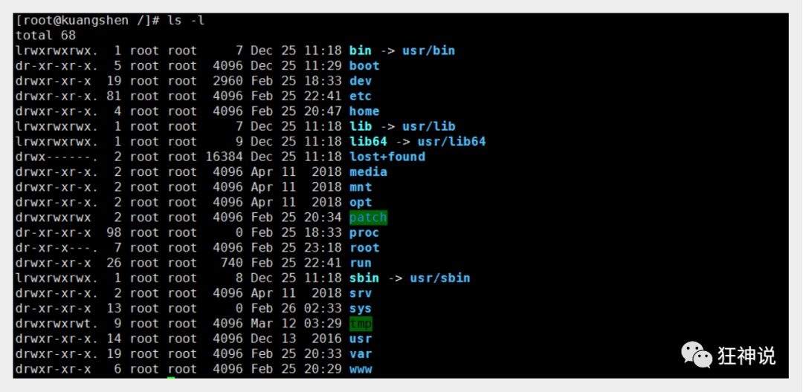
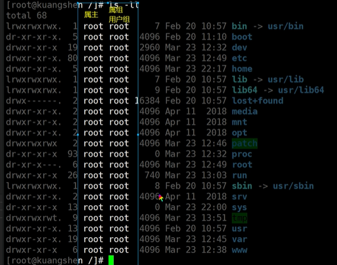
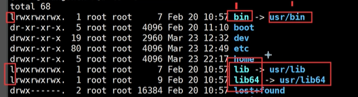

### 基本属性

> 看懂文件属性

Linux系统是一种典型的多用户系统，不同的用户处于不同的地位，拥有不同的权限。为了保护系统的安全性，Linux系统对不同的用户访问同一文件（包括目录文件）的权限做了不同的规定。

在Linux中我们可以使用`ll`或者`ls –l`命令来显示一个文件的属性以及文件所属的用户和组，如：



实例中，boot文件的第一个属性用"d"表示。"d"在Linux中代表该文件是一个目录文件。

在Linux中第一个字符代表这个文件是目录、文件或链接文件等等：

- 当为[ **d** ]则是目录
- 当为[ **-** ]则是文件；
- 若是[ **l** ]则表示为链接文档 ( link file )；
- 若是[ **b** ]则表示为装置文件里面的可供储存的接口设备 ( 可随机存取装置 )；
- 若是[ **c** ]则表示为装置文件里面的串行端口设备，例如键盘、鼠标 ( 一次性读取装置 )。

接下来的字符中，以三个为一组，且均为『rwx』 的三个参数的组合。

其中，[ r ]代表可读(read)、[ w ]代表可写(write)、[ x ]代表可执行(execute)。

要注意的是，这三个权限的位置不会改变，如果没有权限，就会出现减号[ - ]而已。

每个文件的属性由左边第一部分的10个字符来确定（如下图）：


权限

* 属主权限-文件所属用户的权限
* 属组权限-文件所属的组的用户权限
* 其他用户-其他用户的权限



从左至右用0-9这些数字来表示。

第0位确定文件类型，第1-3位确定属主（该文件的所有者）拥有该文件的权限。第4-6位确定属组（所有者的同组用户）拥有该文件的权限，第7-9位确定其他用户拥有该文件的权限。

其中：

第1、4、7位表示读权限，如果用"r"字符表示，则有读权限，如果用"-"字符表示，则没有读权限；

第2、5、8位表示写权限，如果用"w"字符表示，则有写权限，如果用"-"字符表示没有写权限；

第3、6、9位表示可执行权限，如果用"x"字符表示，则有执行权限，如果用"-"字符表示，则没有执行权限。

对于文件来说，它都有一个特定的所有者，也就是对该文件具有所有权的用户。

同时，在Linux系统中，用户是按组分类的，一个用户属于一个或多个组。

文件所有者以外的用户又可以分为文件所有者的同组用户和其他用户。

因此，Linux系统按文件所有者、文件所有者同组用户和其他用户来规定了不同的文件访问权限。

在以上实例中，boot 文件是一个目录文件，属主和属组都为 root。


#### 快捷方式和物理路径



> 修改文件属性

#### 权限命令

**1、chgrp：更改文件属组**

```
chgrp [-R] 属组名 文件名
```

-R：递归更改文件属组，就是在更改某个目录文件的属组时，如果加上-R的参数，那么该目录下的所有文件的属组都会更改。

**2、chown：更改文件属主，也可以同时更改文件属组**

```
chown [–R] 属主名 文件名
chown [-R] 属主名：属组名 文件名
```

**3、chmod：更改文件9个属性**

```
chmod [-R] xyz 文件或目录
```

Linux文件属性有两种设置方法，一种是数字，一种是符号。

Linux文件的基本权限就有九个，分别是owner/group/others三种身份各有自己的read/write/execute权限。

先复习一下刚刚上面提到的数据：文件的权限字符为：『-rwxrwxrwx』， 这九个权限是三个三个一组的！其中，我们可以使用数字来代表各个权限，各权限的分数对照表如下：

```
r:4     w:2         x:1
```

每种身份(owner/group/others)各自的三个权限(r/w/x)分数是需要累加的，例如当权限为：[-rwxrwx---] 分数则是：

- owner = rwx = 4+2+1 = 7
- group = rwx = 4+2+1 = 7
- others= --- = 0+0+0 = 0

```
chmod 770 filename
```

可以自己下去多进行测试！


### 文件内容查看

> 概述

#### 基本命令目录

Linux系统中使用以下命令来查看文件的内容：

- cat 由第一行开始显示文件内容
- tac 从最后一行开始显示，可以看出 tac 是 cat 的倒着写！
- nl  显示的时候，顺道输出行号！
- more 一页一页的显示文件内容
- less 与 more 类似，但是比 more 更好的是，他可以往前翻页！
- head 只看头几行
- tail 只看尾巴几行

你可以使用 *man [命令]*来查看各个命令的使用文档，如 ：man cp。

##### cat 由第一行开始显示文件内容

语法：

```
cat [-AbEnTv]
```

选项与参数：

- -A ：相当於 -vET 的整合选项，可列出一些特殊字符而不是空白而已；
- -b ：列出行号，仅针对非空白行做行号显示，空白行不标行号！
- -E ：将结尾的断行字节 $ 显示出来；
- -n ：列印出行号，连同空白行也会有行号，与 -b 的选项不同；
- -T ：将 [tab] 按键以 ^I 显示出来；
- -v ：列出一些看不出来的特殊字符

测试：

```
# 查看网络配置: 文件地址 /etc/sysconfig/network-scripts/
[root@kuangshen ~]# cat /etc/sysconfig/network-scripts/ifcfg-eth0
DEVICE=eth0
BOOTPROTO=dhcp
ONBOOT=yes
```

##### tac

tac与cat命令刚好相反，文件内容从最后一行开始显示，可以看出 tac 是 cat 的倒着写！如：

```
[root@kuangshen ~]# tac /etc/sysconfig/network-scripts/ifcfg-eth0
ONBOOT=yes
BOOTPROTO=dhcp
DEVICE=eth0
```

##### nl  显示行号

语法：

```
nl [-bnw] 文件
```

选项与参数：

- -b ：指定行号指定的方式，主要有两种：-b a ：表示不论是否为空行，也同样列出行号(类似 cat -n)；-b t ：如果有空行，空的那一行不要列出行号(默认值)；
- -n ：列出行号表示的方法，主要有三种：-n ln ：行号在荧幕的最左方显示；-n rn ：行号在自己栏位的最右方显示，且不加 0 ；-n rz ：行号在自己栏位的最右方显示，且加 0 ；
- -w ：行号栏位的占用的位数。

测试：

```
[root@kuangshen ~]# nl /etc/sysconfig/network-scripts/ifcfg-eth0
1DEVICE=eth0
2BOOTPROTO=dhcp
3ONBOOT=yes
```


##### more  一页一页翻动

在 more 这个程序的运行过程中，你有几个按键可以按的：

- 空白键 (space)：代表向下翻一页；
- Enter   ：代表向下翻『一行』；
- /字串   ：代表在这个显示的内容当中，向下搜寻『字串』这个关键字；
- :f    ：立刻显示出档名以及目前显示的行数；
- q    ：代表立刻离开 more ，不再显示该文件内容。
- b 或 [ctrl]-b ：代表往回翻页，不过这动作只对文件有用，对管线无用。

```
[root@kuangshen etc]# more /etc/csh.login
....(中间省略)....
--More--(28%) # 重点在这一行喔！你的光标也会在这里等待你的命令
```


##### less  一页一页翻动，以下实例输出/etc/man.config文件的内容：

less运行时可以输入的命令有：

- 空白键  ：向下翻动一页；
- [pagedown]：向下翻动一页；
- [pageup] ：向上翻动一页；
- /字串  ：向下搜寻『字串』的功能；
- ?字串  ：向上搜寻『字串』的功能；
- n   ：重复前一个搜寻 (与 / 或 ? 有关！)
- N   ：反向的重复前一个搜寻 (与 / 或 ? 有关！)
- q   ：离开 less 这个程序；

```
[root@kuangshen etc]# more /etc/csh.login
....(中间省略)....
:   # 这里可以等待你输入命令！
```


##### head  取出文件前面几行

语法：

```
head [-n number] 文件
```

选项与参数：**-n** 后面接数字，代表显示几行的意思！

默认的情况中，显示前面 10 行！若要显示前 20 行，就得要这样：

```
[root@kuangshen etc]# head -n 20 /etc/csh.login
```


##### tail  取出文件后面几行

语法：

```
tail [-n number] 文件
```

选项与参数：

- -n ：后面接数字，代表显示几行的意思

默认的情况中，显示最后 10 行！若要显示最后 20 行，就得要这样：

```
[root@kuangshen etc]# tail -n 20 /etc/csh.login
```


> 拓展：Linux 链接概念

Linux 链接分两种，一种被称为硬链接（Hard Link），另一种被称为符号链接（Symbolic Link）。

情况下，**ln** 命令产生硬链接。

**硬连接**

硬连接指通过索引节点来进行连接。在 Linux 的文件系统中，保存在磁盘分区中的文件不管是什么类型都给它分配一个编号，称为索引节点号(Inode Index)。在 Linux 中，多个文件名指向同一索引节点是存在的。比如：A 是 B 的硬链接（A 和 B 都是文件名），则 A 的目录项中的 inode 节点号与 B 的目录项中的 inode 节点号相同，即一个 inode 节点对应两个不同的文件名，两个文件名指向同一个文件，A 和 B 对文件系统来说是完全平等的。删除其中任何一个都不会影响另外一个的访问。

硬连接的作用是允许一个文件拥有多个有效路径名，这样用户就可以建立硬连接到重要文件，以防止“误删”的功能。其原因如上所述，因为对应该目录的索引节点有一个以上的连接。只删除一个连接并不影响索引节点本身和其它的连接，只有当最后一个连接被删除后，文件的数据块及目录的连接才会被释放。也就是说，文件真正删除的条件是与之相关的所有硬连接文件均被删除。

**软连接**

另外一种连接称之为符号连接（Symbolic Link），也叫软连接。软链接文件有类似于 Windows 的快捷方式。它实际上是一个特殊的文件。在符号连接中，文件实际上是一个文本文件，其中包含的有另一文件的位置信息。比如：A 是 B 的软链接（A 和 B 都是文件名），A 的目录项中的 inode 节点号与 B 的目录项中的 inode 节点号不相同，A 和 B 指向的是两个不同的 inode，继而指向两块不同的数据块。但是 A 的数据块中存放的只是 B 的路径名（可以根据这个找到 B 的目录项）。A 和 B 之间是“主从”关系，如果 B 被删除了，A 仍然存在（因为两个是不同的文件），但指向的是一个无效的链接。

**测试：**

```
[root@kuangshen /]# cd /home
[root@kuangshen home]# touch f1 # 创建一个测试文件f1
[root@kuangshen home]# ls
f1
[root@kuangshen home]# ln f1 f2     # 创建f1的一个硬连接文件f2
[root@kuangshen home]# ln -s f1 f3   # 创建f1的一个符号连接文件f3
[root@kuangshen home]# ls -li       # -i参数显示文件的inode节点信息
397247 -rw-r--r-- 2 root root     0 Mar 13 00:50 f1
397247 -rw-r--r-- 2 root root     0 Mar 13 00:50 f2
397248 lrwxrwxrwx 1 root root     2 Mar 13 00:50 f3 -> f1
```

从上面的结果中可以看出，硬连接文件 f2 与原文件 f1 的 inode 节点相同，均为 397247，然而符号连接文件的 inode 节点不同。

```
# echo 字符串输出 >> f1 输出到 f1文件
[root@kuangshen home]# echo "I am f1 file" >>f1
[root@kuangshen home]# cat f1
I am f1 file
[root@kuangshen home]# cat f2
I am f1 file
[root@kuangshen home]# cat f3
I am f1 file
[root@kuangshen home]# rm -f f1
[root@kuangshen home]# cat f2
I am f1 file
[root@kuangshen home]# cat f3
cat: f3: No such file or directory
```

通过上面的测试可以看出：当删除原始文件 f1 后，硬连接 f2 不受影响，但是符号连接 f1 文件无效；

依此您可以做一些相关的测试，可以得到以下全部结论：

- 删除符号连接f3,对f1,f2无影响；
- 删除硬连接f2，对f1,f3也无影响；
- 删除原文件f1，对硬连接f2没有影响，导致符号连接f3失效；
- 同时删除原文件f1,硬连接f2，整个文件会真正的被删除。