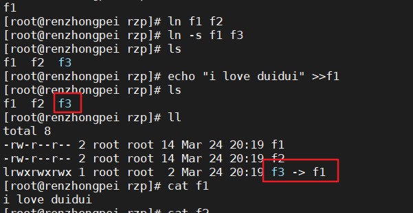
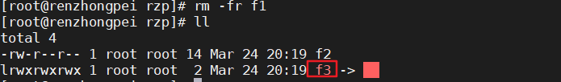

Linux链接分为两种

* 硬链接：假设B是A的硬链接，那么B和A指向同一个文件！
  * 允许一个文件拥有多个路径。
  * A路径删除了，B路径仍然存在，可以防止误删除。
* 软链接：软链接类似Windows下的快捷方式，删除源文件，快捷方式也访问不了。
* 创建链接：

>ln    硬链接
>
>ln -s 软链接

```bash
[root@renzhongpei rzp]# touch f1  #创建f1
[root@renzhongpei rzp]# ls
f1
[root@renzhongpei rzp]# ln f1 f2    #创建f2硬链接
[root@renzhongpei rzp]# ln -s f1 f3     #创建f3软链接
[root@renzhongpei rzp]# ls
f1  f2  f3
[root@renzhongpei rzp]# echo "i love duidui" >>f1    #写入f1
[root@renzhongpei rzp]# ls
f1  f2  f3
[root@renzhongpei rzp]# ll
total 8
-rw-r--r-- 2 root root 14 Mar 24 20:19 f1
-rw-r--r-- 2 root root 14 Mar 24 20:19 f2
lrwxrwxrwx 1 root root  2 Mar 24 20:19 f3 -> f1
[root@renzhongpei rzp]# cat f1
i love duidui
[root@renzhongpei rzp]# cat f2
i love duidui
[root@renzhongpei rzp]# cat f3
i love duidui

```



* 删除f1后，f2还在，f3就查看不了了

```bash
[root@renzhongpei rzp]# rm -fr f1
[root@renzhongpei rzp]# ll
total 4
-rw-r--r-- 1 root root 14 Mar 24 20:19 f2
lrwxrwxrwx 1 root root  2 Mar 24 20:19 f3 -> f1
[root@renzhongpei rzp]# cat f2
i love duidui
[root@renzhongpei rzp]# cat f3
cat: f3: No such file or directory
[root@renzhongpei rzp]#

```


