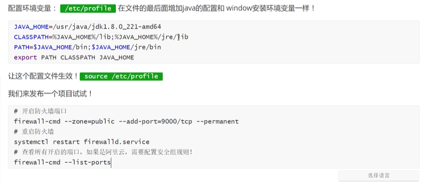

### jdk安装（rpm安装）

1、rpm下载地址http://www.oracle.com/technetwork/java/javase/downloads/index.html

2、如果有安装openjdk 则卸载

```
[root@kuangshen ~]# java -version
java version "1.8.0_121"
Java(TM) SE Runtime Environment (build 1.8.0_121-b13)
Java HotSpot(TM) 64-Bit Server VM (build 25.121-b13, mixed mode)
# 检查
[root@kuangshen ~]# rpm -qa|grep jdk
jdk1.8.0_121-1.8.0_121-fcs.x86_64
# 卸载 -e --nodeps 强制删除
[root@kuangshen ~]# rpm -e --nodeps jdk1.8.0_121-1.8.0_121-fcs.x86_64
[root@kuangshen ~]# java -version
-bash: /usr/bin/java: No such file or directory  # OK
```

3、安装JDK

*  安装完成后配置环境变量 文件：/etc/profile
* source /etc/profile

```
# 安装java rpm
[root@kuangshen kuangshen]# rpm -ivh jdk-8u221-linux-x64.rpm

# 安装完成后配置环境变量 文件：/etc/profile
JAVA_HOME=/usr/java/jdk1.8.0_221-amd64
CLASSPATH=%JAVA_HOME%/lib:%JAVA_HOME%/jre/lib
PATH=$PATH:$JAVA_HOME/bin:$JAVA_HOME/jre/bin
export PATH CLASSPATH JAVA_HOME
# 保存退出

# 让新增的环境变量生效！
source /etc/profile

# 测试 java -version
[root@kuangshen java]# java -version
java version "1.8.0_221"
Java(TM) SE Runtime Environment (build 1.8.0_221-b11)
Java HotSpot(TM) 64-Bit Server VM (build 25.221-b11, mixed mode)
```


### Tomcat安装（解压缩安装）

1、安装好了Java环境后我们可以测试下Tomcat！准备好Tomcat的安装包！

2、将文件移动到/usr/tomcat/下，并解压！

```
[root@kuangshen kuangshen]# mv apache-tomcat-9.0.22.tar.gz /usr
[root@kuangshen kuangshen]# cd /usr
[root@kuangshen usr]# ls
apache-tomcat-9.0.22.tar.gz
[root@kuangshen usr]# tar -zxvf apache-tomcat-9.0.22.tar.gz   # 解压
```

3、运行Tomcat，进入bin目录，和我们以前在Windows下看的都是一样的

```
# 执行：startup.sh -->启动tomcat
# 执行：shutdown.sh -->关闭tomcat
./startup.sh
./shutdown.sh
```

4、确保Linux的防火墙端口是开启的，如果是阿里云，需要保证阿里云的安全组策略是开放的！

```
# 查看firewall服务状态
systemctl status firewalld

# 开启、重启、关闭、firewalld.service服务
# 开启
service firewalld start
# 重启
service firewalld restart
# 关闭
service firewalld stop

# 查看防火墙规则
firewall-cmd --list-all    # 查看全部信息
firewall-cmd --list-ports  # 只看端口信息

# 开启端口
开端口命令：firewall-cmd --zone=public --add-port=80/tcp --permanent
重启防火墙：systemctl restart firewalld.service

命令含义：
--zone #作用域
--add-port=80/tcp  #添加端口，格式为：端口/通讯协议
--permanent   #永久生效，没有此参数重启后失效
```



### 安装Docker（yum安装）

> 基于 CentOS 7 安装

1. 官网安装参考手册：https://docs.docker.com/install/linux/docker-ce/centos/

2. 确定你是CentOS7及以上版本

   ```
   [root@192 Desktop]# cat /etc/redhat-release
   CentOS Linux release 7.2.1511 (Core)
   ```

3. yum安装gcc相关（需要确保 虚拟机可以上外网 ）

   ```
   yum -y install gcc
   yum -y install gcc-c++
   ```

4. 卸载旧版本

   ```
   yum -y remove docker docker-common docker-selinux docker-engine
   # 官网版本
   yum remove docker \
             docker-client \
             docker-client-latest \
             docker-common \
             docker-latest \
             docker-latest-logrotate \
             docker-logrotate \
             docker-engine
   ```

5. 安装需要的软件包

   ```
   yum install -y yum-utils device-mapper-persistent-data lvm2
   ```

6. 设置stable镜像仓库

   ```
   # 错误
   yum-config-manager --add-repo https://download.docker.com/linux/centos/docker-ce.repo
   ## 报错
   [Errno 14] curl#35 - TCP connection reset by peer
   [Errno 12] curl#35 - Timeout
   
   # 正确推荐使用国内的
   yum-config-manager --add-repo http://mirrors.aliyun.com/docker-ce/linux/centos/docker-ce.repo
   ```

7. 更新yum软件包索引

   ```
   yum makecache fast
   ```

8. 安装Docker CE

   ```
   yum -y install docker-ce docker-ce-cli containerd.io
   ```

9. 启动docker

   ```
   systemctl start docker
   ```

10. 测试

    ```
    docker version
    
    docker run hello-world
    
    docker images
    ```