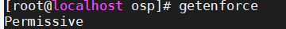
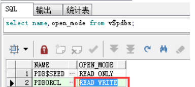
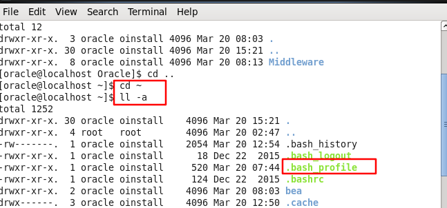

### VMware创建虚拟机

* 虚拟机至少2G内存，40G储存。

### 挂载本地YUM源

1. 虚拟机选择光盘


2. 输入 df -Th看到有dev/sr0就说明成功了


3. 确认/mnt/cdrom是否存在，如果不存在创建cdrom文件夹。

4. 挂载到/mnt/cdrom中：`mount -t iso9660 -o remount,rw /dev/sr0 /mnt/cdrom`

5. 把 /etc/yum.repos.d/文件夹下的repo文件删除掉

* packagekit-media似乎不影响--查作用


6. 创建一个repo后缀的文件


7. 在该文件中添加以下内容:

>[name]
>
>name=my new repo 
>
>baseurl=file:/mnt/cdrom
>
>enabled=1
>
>gpgcheck=0 

```sql


[name]  #括号中的名称为仓库源名称，通常为字母和数字，必须填写
name=my new repo     #对yum的描述，可写可不写
baseurl=file:///mnt/cdrom    #baseurl表示声明yum可以管理并使用的rpm包路径,必须填写
enabled=1    #enabled表示当前仓库是否开启，1为开启，0为关闭，此项不写默认为开启
gpgcheck=0   #gpgcheck表示安装rpm包时，是否基于公私钥对匹配包的安全信息，1表示开启， #0表示关闭，此项不写默认为验证

————————————————
版权声明：本文为CSDN博主「谢公子」的原创文章，遵循 CC 4.0 BY-SA 版权协议，转载请附上原文出处链接及本声明。
原文链接：https://blog.csdn.net/qq_36119192/article/details/82222175
```

8. 这时已经挂载成功，可以通过yum命令安装依赖。


### 安装Oracle的问题

##### 1.PRVF-0002


* 要使用root账户配置/etc/hosts
  * 前面填IP地址，后面填主机名称


* IP地址可以通过ifconfig查到

* 主机名称可以通过hostname查到


##### 2.授予权限

* 安装包要授予755权限
  chown -R oracle:oinstall /安装包所在目录

  chmod -R 755 /安装包所在目录

* 安装路径

  * 最好把所有路径直接创建完

    mkdir -p /u01/app/oracle/oradata

    mkdir -p /u01/app/oracle/product/12.2.0/dbhome_1

  * 要给775权限

    chown -R oracle:oinstall /u01

    chmod -R 755 /u01

* 权限语法：

  ```
  chmod abc file
  其中a,b,c各为一个数字，分别表示User、Group、及Other的权限。
  
  r=4，w=2，x=1
  若要rwx属性则4+2+1=7；
  若要rw-属性则4+2=6；
  若要r-x属性则4+1=5。
  
  -c : 若该文件权限确实已经更改，才显示其更改动作
  -f : 若该文件权限无法被更改也不要显示错误讯息
  -v : 显示权限变更的详细资料
  -R : 对目前目录下的所有文件与子目录进行相同的权限变更(即以递回的方式逐个变更)
  ```

  

##### 3.用PLSQL连接

* 配置服务器的sqlnet.ora文件

  ```
  NAMES.DIRECTORY_PATH= (TNSNAMES, ONAMES, HOSTNAME)
  SQLNET.ALLOWED_LOGON_VERSION_CLIENT=8
  SQLNET.ALLOWED_LOGON_VERSION_SERVER=8
  ```
  
* 关闭防火墙（root用户）

  ```
  /etc/init.d/iptables stop
  setenforce  0
  ```

  * /etc/init.d/iptables status  查看防火墙状态

  * getenforce  查看selinux状态

    

* 可能要在sqlplus重新设置一次sys密码才能用plsql登录

##### 4.创建导出dmp文件的目录

```sql
create directory dump_dir as 'D:/oradata/orcl/dmpfile'; 
grant read,write on directory dump_dir to username; 
```

##### 5. 12c的容器数据库建表空间！

* `show con_name`或者`select name,open_mode from v$pdbs;`可以显示容器

  

* 默认容器为CDB%ROOT

  * 该容器下可以建表空间
  * 该容器下建立的用户为通用用户（common user）
    * 通用用户创建后，默认在所有PDB下中建立相同用户
    * 用户名称必须以C##开头

* 本地容器为创建时可以改的名字，默认为PDBORCL

* `alter session set container=PDBORCL`可以修改当前所在容器，最好修改后再创建表空间和用户

### 如何配置环境变量

1. 环境变量是跟随用户的，配置文件是用户主文件夹的/.bash_profile




2. 注意path用：分割

```
# Get the aliases and functions
if [ -f ~/.bashrc ]; then
        . ~/.bashrc
fi

# User specific environment and startup programs

ORACLE_BASE=/u01/app/oracle
ORACLE_HOME=$ORACLE_BASE/product/12.2.0/dbhome_1
ORACLE_SID=orcl
export ORACLE_BASE ORACLE_HOME ORACLE_SID

JAVA_HOME=/orinsta/jdk1.6.0_171
JAVA_BIN=/orinsta/jdk-6u171-linux-x64.bin
CLASSPATH=.:$JAVA_HOME/lib/dt.jar:$JAVA_HOME/lib/tools.jar
export JAVA_HOME JAVA_BIN CLASSPATH

PATH=$PATH:$PATH:$HOME/bin:$ORACLE_HOME/bin:$JAVA_HOME/bin

export PATH

```

3. 配置完以后用以下命令生效：

```
source ~/.bash_profile
```

