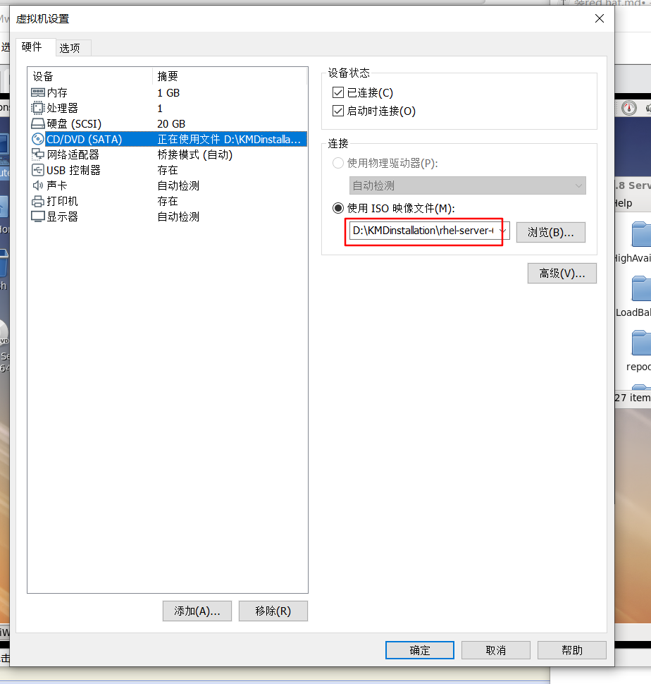
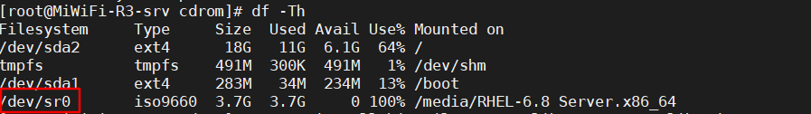
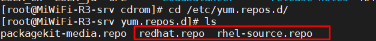
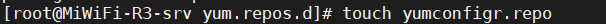
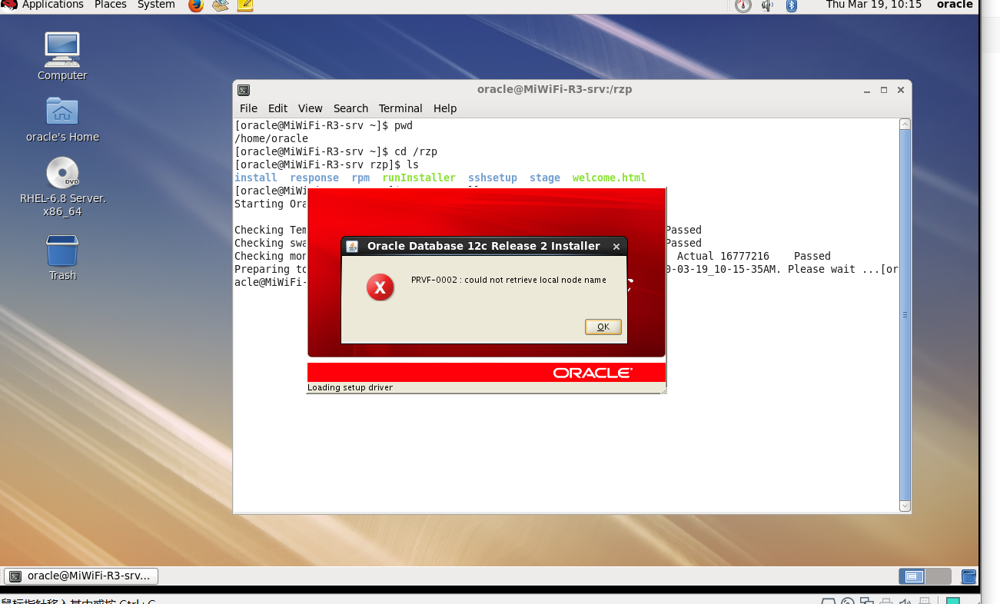
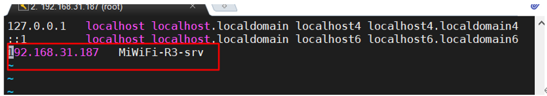
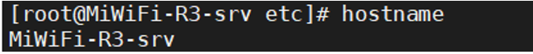

1. VMware

### 挂载本地YUM库

1.虚拟机选择光盘



2.输入 df -Th看到有dev/sr0就说明成功了



3.确认/mnt/cdrom是否存在，如果不存在创建cdrom文件夹。

4.把 /etc/yum.repos.d/文件夹下的repo文件删除掉

* packagekit-media似乎不影响--查作用



5.创建一个repo后缀的文件



6.在该文件中添加以下内容:

>[name]
>
>name=my new repo 
>
>baseurl=file:/mnt/cdrom
>
>enabled=1
>
>gpgcheck=0 

```sql

[name]  #括号中的名称为仓库源名称，通常为字母和数字，必须填写
name=my new repo     #对yum的描述，可写可不写
baseurl=file:///mnt/cdrom    #baseurl表示声明yum可以管理并使用的rpm包路径,必须填写
enabled=1    #enabled表示当前仓库是否开启，1为开启，0为关闭，此项不写默认为开启
gpgcheck=0   #gpgcheck表示安装rpm包时，是否基于公私钥对匹配包的安全信息，1表示开启， #0表示关闭，此项不写默认为验证

————————————————
版权声明：本文为CSDN博主「谢公子」的原创文章，遵循 CC 4.0 BY-SA 版权协议，转载请附上原文出处链接及本声明。
原文链接：https://blog.csdn.net/qq_36119192/article/details/82222175
```

7.这时已经挂载成功，可以通过yum命令安装依赖。


### 安装Oracle的问题

#### 1.



要使用root账户配置/etc/hosts

前面填IP地址，后面填主机名称



主机名称可以通过hostname查到

